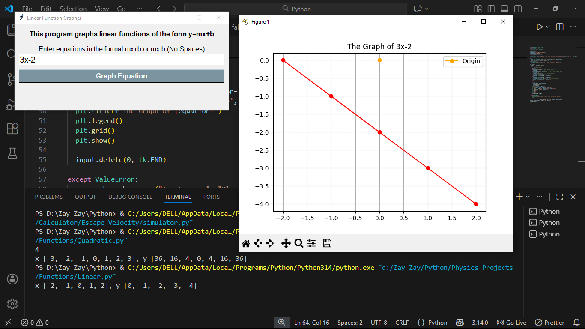

# Function-Grapher

[](https://github.com/ZayThihaAung/Function-Grapher/actions)
[](LICENSE)
[](https://www.python.org/)

This program is designed to graph absolute, square root, linear and quadratic functions using Python. It's intended to be helpful for students learning function shapes and parameters.

Features
- Plot absolute value, square-root, linear and quadratic functions
- Customizable plotting ranges and parameters
- Uses matplotlib and numpy for crisp visuals
- Example usage and command-line instructions included

Install
- From PyPI (once published)
```bash
pip install function-grapher
```

- Directly from GitHub (no PyPI publish required)
```bash
pip install git+https://github.com/ZayThihaAung/Function-Grapher.git
```

- Local editable install (for development)
```bash
git clone https://github.com/ZayThihaAung/Function-Grapher.git
cd Function-Grapher
pip install -e .
```

Usage

Note: distribution name (pip) can be `function-grapher`, but the Python import name must be a valid identifier. The common convention is to use an underscore for the import name (for example `function_grapher`). Adjust the import below to match the actual module name in this repository.

```python
# Example: import a plotting function from the package
from function_grapher import plot_quadratic  # use underscore if your module uses underscores

# plot a quadratic y = ax^2 + bx + c
plot_quadratic(a=1, b=0, c=0, x_range=(-10, 10))
```

If the entry point is a script file (for example `function_grapher.py`) you can also run it directly:
```bash
python function_grapher.py
```

Publishing to PyPI (brief)
1. Ensure your project has packaging metadata (pyproject.toml or setup.cfg/setup.py).
2. Build distributions:
   ```bash
   python -m build
   ```
3. Upload with Twine:
   ```bash
   python -m pip install --upgrade twine
   python -m twine upload dist/*
   ```

Demo 

or 
[!Watch demo on Canva](link)

Usage examples
- Plot a quadratic: set coefficients a, b, c
- Plot a linear function: set slope m and intercept b
- Plot absolute value and square-root functions with domain/range options

Contributing
- Please read CONTRIBUTING.md for guidelines.
- Open issues for features or bugs.
- Pull requests welcome!

License
- This project is licensed under the MIT License — see the LICENSE file for details.

Contact
- Maintainer: ZayThihaAung
- Repo: https://github.com/ZayThihaAung/Function-Grapher
